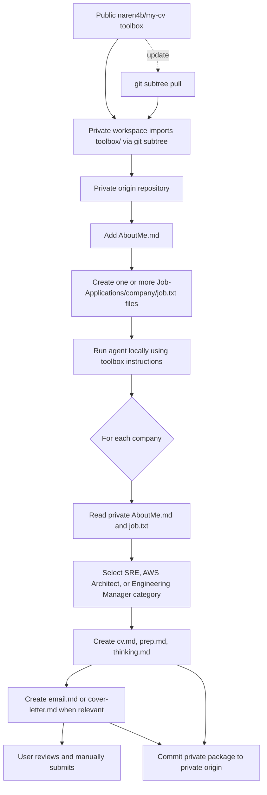

# Job Search Toolbox Architecture

## Purpose

`naren4b/my-cv` is a public, reusable AI toolbox. It contains only generic agents, prompts, skills, templates, and safeguards. A separate private workspace repository is the single source of truth for candidate information and generated job-application packages.

## Workflow design



## Create the private workspace

Create an empty private GitHub repository such as `my-cv-private`, with an initial README. Then clone it and import the public toolbox:

```bash
git clone https://github.com/<your-account>/my-cv-private.git my-job-search
cd my-job-search
git remote add toolbox https://github.com/naren4b/my-cv.git
git subtree add --prefix=toolbox toolbox main --squash
git push origin main
```

Use `origin` only for the private repository. The `toolbox` remote is read-only; never push the private workspace to it.

## Daily operation for each job

1. Start with the private workspace and synchronise it:

   ```bash
   git pull origin main
   ```

2. Create or update one folder and its original role description:

   ```text
   Job-Applications/[company]/job.txt
   ```

   Keep `Job-tracker.csv` at the private workspace root as the versioned application dashboard. The agent creates a missing row after package artifacts are generated; the user controls all status changes.

3. Run this prompt in Codex, VS Code, or Cursor:

   ```text
   Read toolbox/AGENTS.md and toolbox/Architecture.md. Generate the job package for Job-Applications/[company] using AboutMe.md and that company’s job.txt. Create cv.md, prep.md, thinking.md, and email.md or cover-letter.md. Do not submit or send anything.
   ```

4. Review the generated files. The user manually sends email or submits an application.

5. Version the complete private package:

   ```bash
   git add AboutMe.md Job-Applications
   git commit -m "Add or update [company] job package"
   git push origin main
   ```

## Update the public toolbox

Pull public AI-artifact updates only when wanted, then record the imported version in the private repository:

```bash
git subtree pull --prefix=toolbox toolbox main --squash
git push origin main
```

## Repository responsibilities

| Location | Contains | Must not contain |
| --- | --- | --- |
| Public `naren4b/my-cv` | Generic AI artifacts and documentation | Candidate data, job packages, recruiter correspondence, application history |
| Private workspace `origin` | `AboutMe.md`, `Job-Applications/`, generated outputs, private history | Pushes to the public toolbox remote |
| Local checkout | The private workspace plus imported `toolbox/` | Unreviewed automatic submission actions |

## Private workspace contract

```text
private-workspace/
  toolbox/                              # imported public AI toolbox
  AboutMe.md                            # private, versioned in private origin
  Job-Applications/[company]/
    job.txt                             # private job input
    cv.md                               # generated tailored CV
    prep.md                             # preparation and gap analysis
    thinking.md                         # concise decision record
    email.md                            # recruiter email when relevant
    cover-letter.md                     # application letter when relevant
  Job-tracker.csv                       # private, versioned application dashboard
```

## Job-package process

1. Read private `AboutMe.md` and the company `job.txt`.
2. Select exactly one profile category: Senior SRE Engineer, AWS Solutions Architect, or Engineering Manager.
3. Create or refresh the package files in the company folder.
4. Use supported facts only and state genuine gaps in `prep.md`.
5. Keep `thinking.md` as a short decision record—not hidden chain-of-thought.
6. The user alone sends messages, submits applications, and confirms status.

## Public toolbox layout

```text
.github/       agents, prompts, instructions, and safety hooks
.job-search/   reusable skills, templates, and portal research
.archive/      preserved historical generic material
AGENTS.md      compact agent entry contract
Architecture.md detailed operating design
README.md      quick setup and use
```

## Agent safeguards

- Never place private material in the public toolbox repository.
- Never invent achievements, qualifications, compensation, or submission status.
- Never submit an application or send a message without the user.
