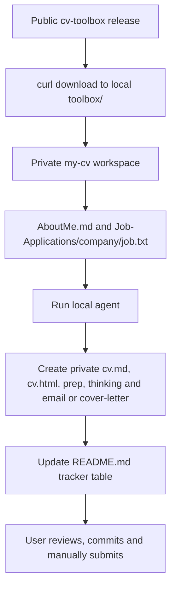

# Job Search Toolbox Architecture

## Purpose

`naren4b/cv-toolbox` is a public, reusable AI toolbox. The private `my-cv` repository is the only versioned location for candidate information and generated job-application packages. The toolbox is downloaded locally from a fixed public release and is ignored by the private repository.



## Create the private workspace

Create and clone a private repository. `toolbox/` is local-only and ignored:

```bash
git clone https://github.com/<your-account>/my-cv.git my-cv
cd my-cv
printf '/toolbox/\n' >> .gitignore
git add .gitignore
git commit -m "Ignore local toolbox"
git push origin main
VERSION=v1.1 # Choose the release deliberately
mkdir -p toolbox
curl -fsSL https://github.com/naren4b/cv-toolbox/archive/refs/tags/$VERSION.tar.gz \
  | tar -xz --strip-components=1 -C toolbox
```
## Daily operation

1. Add or update `Job-Applications/[company]/job.txt`.
2. Keep the application-tracker table in root `README.md` as the versioned dashboard.
3. Run this prompt in Codex, VS Code, or Cursor:

   ```text
   Read toolbox/AGENTS.md and toolbox/Architecture.md. Generate the job package for Job-Applications/[company] using AboutMe.md and that company’s job.txt. Create cv.md, cv.html, prep.md, thinking.md, and email.md or cover-letter.md. Do not submit or send anything.
   ```

4. Run `bash toolbox/scripts/check-package.sh Job-Applications/[company]`, then review the generated files and verify every candidate claim against `AboutMe.md`.
5. The user alone sends email or submits applications.
6. Commit only private data and package files to `origin`.

## Upgrade the toolbox

Choose a newer release tag deliberately. Replace only the ignored local directory, then verify the new instructions:

```bash
mv toolbox toolbox.previous
mkdir toolbox
curl -fsSL https://github.com/naren4b/cv-toolbox/archive/refs/tags/<release-tag>.tar.gz \
  | tar -xz --strip-components=1 -C toolbox
```

After verification, remove `toolbox.previous` manually. Do not commit either directory.

## Repository responsibilities

| Location | Contains | Must not contain |
| --- | --- | --- |
| Public `naren4b/cv-toolbox` | Generic AI artifacts and documentation | Candidate data, job packages, recruiter correspondence, application history |
| Private `naren4b/my-cv` | `AboutMe.md`, root tracker table, `Job-Applications/`, generated outputs and history | Public toolbox files |
| Local `toolbox/` | Downloaded public release | Private data or Git-tracked files |

## Safeguards

- Never place private material in the public toolbox repository.
- Never invent achievements, qualifications, compensation, or submission status.
- Never submit an application or send a message without the user.
