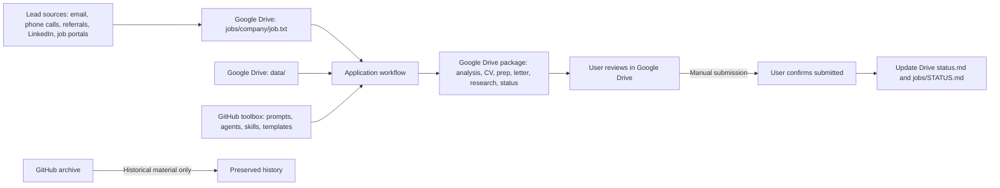

# Job Search 2026: Process Design

## Design decision

Google Drive is the **only active job-application workspace**. Every package is generated, reviewed, submitted, and tracked there. GitHub is a versioned toolbox for reusable prompts, agents, skills, templates, and this process design.

## System design

## Responsibilities

| System | Responsibility |
| --- | --- |
| Google Drive `data/` | Canonical profile and personal information |
| Google Drive `jobs/[company]/` | Lead, job description, application package, review, and follow-up |
| Google Drive `jobs/STATUS.md` | Live portfolio dashboard |
| GitHub `my-cv` | Versioned workflow toolbox only |
| LinkedIn, email, calls, referrals, job portals | Lead discovery and original source material |

## Standard application flow

1. Capture a lead from email, phone calls, a referral, LinkedIn, or a job portal.
2. In Google Drive, create `jobs/[company]/` and save the posting and source reference in `job.txt`.
3. Run the main workflow using the GitHub toolbox.
4. Create and review the complete package in the same Drive folder.
5. Submit manually when the user is satisfied.
6. After user confirmation, update `status.md` and `jobs/STATUS.md` in Google Drive.

## Status model

`New` → `In preparation` → `Ready to apply` → `Submitted` → `Recruiter response` → `Interviewing` → `Offer` / `Closed`

The user alone confirms submission. Nothing is permanently deleted; superseded material is archived first.
