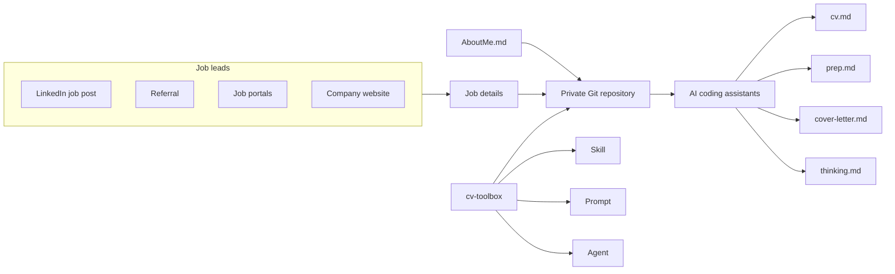

# Job Search Toolbox

**Objective:** provide reusable AI instructions, prompts, agents, and skills for creating tailored job-application packages while keeping all personal data in a private repository.

This public repository is the toolbox. Download a tagged release into your private workspace as `toolbox/`; do not add private files here.

## Design



## Setup

1. Create and clone a private workspace repository.
2. Download `cv-toolbox` into the local, ignored `toolbox/` directory using the release steps in [Architecture.md](Architecture.md).
3. In the private workspace root, add `AboutMe.md` and `Job-Applications/[company]/job.txt`.

## Use

In the private workspace, type:

```text
Read toolbox/AGENTS.md and toolbox/Architecture.md. Generate the job package for Job-Applications/[company] using AboutMe.md and that company’s job.txt. Create cv.md, prep.md, thinking.md, and email.md or cover-letter.md. Do not submit or send anything.
```

Commit generated files to the private workspace repository only.
