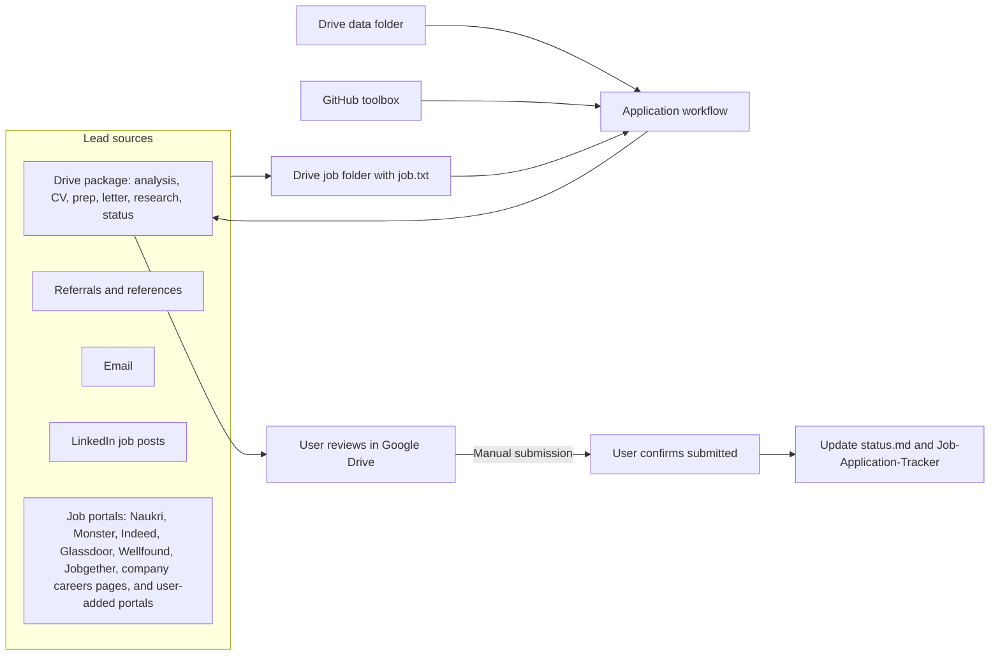

# Job Search Toolbox — Public-Safe Workflow Assets

This repository contains reusable prompts, agents, skills, and templates only. Google Drive is the sole private working location for candidate information, leads, job descriptions, application packages, recruiter messages, and status tracking. Never add candidate-specific or application-specific material here.

## Operating model

| System | Responsibility |
| --- | --- |
| Google Drive `data/` | Canonical profile and personal information |
| Google Drive `Job-Applications/[company]/` | Lead, posting, package, review, and follow-up |
| Google Drive `Job-Application-Tracker` | Live application dashboard |
| GitHub repository | Versioned generic toolbox only |

## Standard application flow

1. Capture a lead and original source.
2. Create `Job-Applications/[company]/` in Drive and add `job.txt`.
3. Use the reusable GitHub toolbox to create the package in that Drive folder.
4. Review the package in Drive.
5. Submit manually only when the user is satisfied.
6. After confirmation, update `status.md` and the Job-Application-Tracker.

## Boundaries

- The user alone confirms submission and permanent deletion.
- Archive superseded material before removal.
- Git history is the change record; a separate changelog file is intentionally not kept.
- `AGENTS.md` remains as the machine-readable operating contract for the reusable agents.
