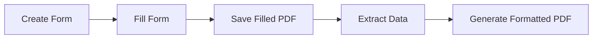

# PDF Form System - User Guide

Create, fill, and process interactive PDF forms for CV/Resume generation.

## 📋 Overview

This system provides three tools:

1. **`create_pdf_form.py`** - Creates an interactive PDF form with fillable fields
2. **`extract_form_data.py`** - Extracts data from filled PDF forms to JSON
3. **`app_template.py`** - Generates formatted PDF from JSON data

## 🚀 Quick Start

### Step 1: Install Dependencies

```bash
pip install -r requirements.txt
```

Required packages:
- `reportlab` - For creating PDF forms
- `pypdf` - For extracting form data
- `fpdf2` - For generating formatted PDFs

### Step 2: Create a Blank PDF Form

```bash
python create_pdf_form.py
```

This creates `CV_FORM_2026-02-05.pdf` with fillable fields for:
- Personal Information (Name, Title, Contact Details)
- Professional Summary
- Core Competencies (6 skill categories)
- Professional Experience (3 positions)
- Education (2 degrees)
- Awards & Certifications

### Step 3: Fill the Form

1. Open the generated PDF form in **Adobe Acrobat Reader** (recommended) or another PDF viewer that supports forms
2. Click on the blue-bordered fields and type your information
3. Tab between fields or click to navigate
4. **Save the filled PDF** when complete

### Step 4: Extract Data from Filled Form

```bash
python extract_form_data.py CV_FORM_2026-02-05.pdf
```

This extracts all filled data and creates `cv_data_from_form_2026-02-05.json`

### Step 5: Generate Formatted PDF Resume

```bash
# First, copy the extracted data to data.json (or use it directly)
cp cv_data_from_form_2026-02-05.json data.json

# Generate formatted PDF
python app_template.py
```

Creates a professionally formatted PDF resume: `NARENDRANATH_PANDA_2026-02-05.pdf`

## 📁 Files Description

### Input Files
- **`pdf_template.json`** - Defines the PDF layout and styling
- **`data.json`** - CV data in JSON format

### Scripts
- **`create_pdf_form.py`** - Form creator
- **`extract_form_data.py`** - Form data extractor  
- **`app_template.py`** - PDF generator from template

### Output Files
- **`CV_FORM_*.pdf`** - Interactive fillable form
- **`cv_data_from_form_*.json`** - Extracted form data
- **`NARENDRANATH_PANDA_*.pdf`** - Final formatted resume

## 🎨 Form Fields Reference

### Personal Information
- `profile_name` - Full Name
- `profile_title` - Professional Title

### Contact Information  
- `email` - Email Address
- `phone` - Phone Number
- `linkedin` - LinkedIn Profile URL
- `website` - Personal Website/Blog
- `location` - City, Country

### Professional Summary
- `professional_summary` - Multi-line text area

### Core Competencies
- `skill_0` - Platform Architecture & Design
- `skill_1` - Cloud & Container Technologies
- `skill_2` - DevOps & CI/CD
- `skill_3` - Observability & Monitoring
- `skill_4` - Programming Languages
- `skill_5` - Other Technical Skills

### Professional Experience (3 positions)
For each position (1-3):
- `exp{N}_position` - Job Title
- `exp{N}_period` - Time Period
- `exp{N}_location` - Location
- `exp{N}_summary` - Summary/Achievements

### Education (2 degrees)
For each degree (1-2):
- `edu{N}_degree` - Degree Name
- `edu{N}_institution` - University/College
- `edu{N}_period` - Years Attended

### Awards & Certifications
- `awards` - Multi-line list (format: `YYYY - Award Title`)

## 💡 Tips & Best Practices

### Filling Forms
- Use **Adobe Acrobat Reader** for best compatibility
- Press **Tab** to move between fields
- Multi-line fields support line breaks (Shift+Enter)
- Save frequently while filling

### Data Format
- **Dates**: Use consistent format (e.g., "Jan 2020 - Present")
- **Skills**: Comma-separated lists work best
- **Awards**: One per line in format `2025 - Award Title`

### Customizing Forms
Edit `create_pdf_form.py` to:
- Add more experience/education sections
- Change field sizes and positions
- Modify colors and styling
- Add custom sections

## 🔄 Complete Workflow



1. **Create**: `python create_pdf_form.py`
2. **Fill**: Open in PDF viewer, fill fields, save
3. **Extract**: `python extract_form_data.py filled_form.pdf`
4. **Generate**: `python app_template.py`

## 🛠️ Advanced Usage

### Custom Output Path

```bash
# Create form with custom name
python create_pdf_form.py

# Extract to specific JSON file
python extract_form_data.py filled_form.pdf output_data.json

# Use custom data file
# (edit app_template.py to change data file path)
```

### Batch Processing

Process multiple filled forms:

```bash
for file in CV_FORM_*.pdf; do
    python extract_form_data.py "$file"
done
```

### Validation

Check extracted data:

```python
import json

with open("cv_data_from_form_2026-02-05.json") as f:
    data = json.load(f)
    
# Validate required fields
assert data["body"]["profile-name"], "Name is required"
assert data["body"]["professional-summary"]["content"], "Summary is required"
```

## 📝 Form Field Specifications

### Text Fields
- Single-line: 20px height
- Multi-line: 60-80px height
- Width: Responsive to page width

### Field Styling
- Border: Blue (`rgb(0, 0, 255)`)
- Background: Light grey when empty
- Text: Black

### Layout
- Page Size: Letter (8.5" × 11")
- Margins: 0.75 inches
- Font: Helvetica
- Labels: 10pt, bold
- Fields: 10pt, regular

## 🐛 Troubleshooting

### Issue: Form fields not editable
**Solution**: Open in Adobe Acrobat Reader, not a browser PDF viewer

### Issue: Data extraction returns empty
**Solution**: Make sure you saved the PDF after filling the fields

### Issue: Generated PDF looks different
**Solution**: Check that `pdf_template.json` matches your data structure

### Issue: Special characters appear incorrectly
**Solution**: The system automatically converts to latin-1 encoding

## 📚 Examples

### Example 1: Quick CV Creation

```bash
# Create and fill form
python create_pdf_form.py
# (Fill form in PDF viewer and save)

# Extract and generate
python extract_form_data.py CV_FORM_2026-02-05.pdf
cp cv_data_from_form_2026-02-05.json data.json
python app_template.py
```

### Example 2: Update Existing CV

```bash
# Start with existing data
python create_pdf_form.py

# Manually populate form from data.json
# (Or programmatically pre-fill - see Advanced)

# Make updates in PDF form
# Extract updated data
python extract_form_data.py updated_form.pdf
```

## 🎯 Next Steps

- Customize form layout in `create_pdf_form.py`
- Modify PDF template in `pdf_template.json`
- Add validation rules
- Create pre-filled forms from existing data
- Export to other formats (HTML, DOCX)

## 📄 License

Free to use and modify for personal and commercial purposes.
